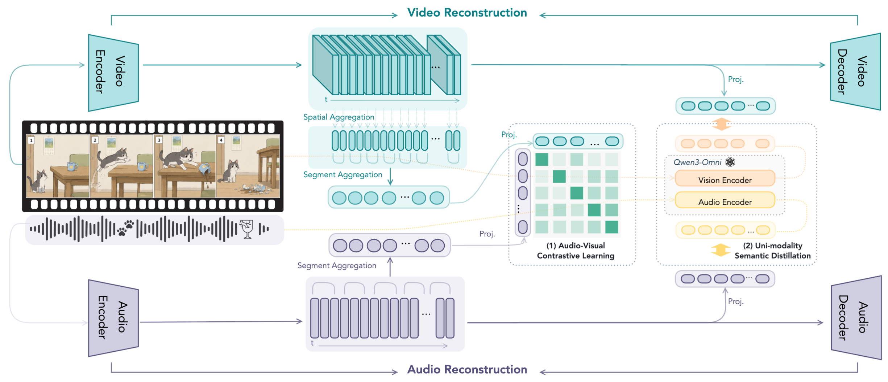
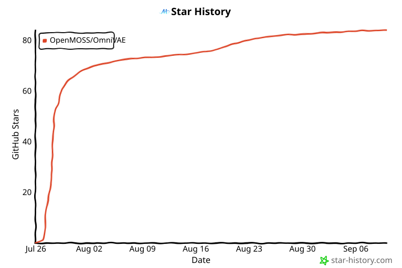

# OmniVAE

[English](README.md) | 简体中文

[](https://openmoss.github.io/OmniVAE.github.io/)
[](https://arxiv.org/abs/2607.00000)
[](https://huggingface.co/OpenMOSS-Team/OmniVAE)
[](LICENSE)

<p align="center">
  <a href="assets/architecture/arch.pdf">
    
  </a>
</p>

**OmniVAE** 是一个统一的音视频 Variational Autoencoder。模型使用独立的 audio encoder 和 video encoder 提取模态特征，并将其对齐到同一个 latent space，为下游音视频生成提供更易对齐的 representation。OmniVAE 支持 audio、video 及 audio-video 的 encoding 与 reconstruction。本文最终采用的 T2AV 配置为 `t2av_recon_distill_avclip`，其余配置均为 baseline 或 ablation，仅用于对比实验。

仓库包含三个主要模块：[VAE](vae/) 提供 OmniVAE 的训练、重建与评测代码；[Generation](generation/) 提供 DiT 训练和 T2AV inference；[Sync](sync/) 用于评估冻结 OmniVAE feature 中的音视频同步信息。此外，仓库还提供实验所需的运行脚本、评测流程和文档。

## 快速开始

### 1. 安装

先配置好与机器匹配的 PyTorch/CUDA 环境，再安装仓库中的三个 package：

```bash
cd /path/to/OmniVAE

pip install -e vae
pip install -e generation
pip install -e sync
```

环境配置和 distributed job 的说明见[安装文档](docs/installation.md)。

### 2. 下载 Release Assets

```bash
pip install -U huggingface_hub
huggingface-cli download OpenMOSS-Team/OmniVAE \
  --repo-type model \
  --local-dir /path/to/omnivae_release \
  --local-dir-use-symlinks False
```

执行下面的脚本，让各个 OmniVAE 模块都从这个目录读取资源：

```bash
cd /path/to/OmniVAE
source scripts/setup_release_root.sh /path/to/omnivae_release
```

脚本会设置 `OMNIVAE_RELEASE_ROOT` 和 `OPEN_SOURCE_ROOT`，也可以手动 export：

```bash
export OMNIVAE_RELEASE_ROOT=/path/to/omnivae_release
export OPEN_SOURCE_ROOT="${OMNIVAE_RELEASE_ROOT}"
```

### 3. 运行单卡 T2AV Inference

下面的命令会用一个样本完成一次 inference，可以先用它确认环境、模型和数据路径是否配置正确：

```bash
bash generation/scripts/av/validate_checkpoints.sh \
  --gpus 0 \
  --ckpt-root "${OMNIVAE_RELEASE_ROOT}/models/dit/t2av" \
  --validation-jsonl "${OMNIVAE_RELEASE_ROOT}/eval/data/t2av/versebench_minimal/versebench_t2av_infer_minimal.jsonl" \
  --experiments t2av_recon_distill_avclip \
  --steps 200000 \
  --cfg 4 \
  --types set3-large \
  --max-examples 1 \
  --output-root outputs/t2av_inference
```

多卡 inference 和其他参数见[推理文档](docs/inference.md)。

## 常用工作流

### 使用 VAE Checkpoint 进行重建

```bash
cd /path/to/OmniVAE/vae

MODE=video \
CHECKPOINT="${OMNIVAE_RELEASE_ROOT}/models/vae/video_only/recon/state_dict.pt" \
CONFIG="${OMNIVAE_RELEASE_ROOT}/models/vae/video_only/recon/config.yaml" \
INPUT_JSONL=/path/to/video_inputs.jsonl \
OUTPUT_DIR=../outputs/vae/video_recon \
bash scripts/infer/run_reconstruct.sh
```

Audio VAE 使用 `MODE=audio`，joint audio-video VAE 使用 `MODE=audio_video`。输入格式和更多示例见 [VAE inference 文档](vae/docs/inference.md)。

### 验证 T2AV Release

Release launcher 默认使用 CFG 4，在 VerseBench `set3-large` 上评测公开 checkpoint。脚本支持本地多卡，也可以直接运行在已经分配好的 PET/distributed job 中；中断后默认会从已有进度继续。

```bash
cd /path/to/OmniVAE
source scripts/setup_release_root.sh /path/to/omnivae_release

bash scripts/release_launchers/run_t2av_release_compare_distributed.sh
```

默认参数、输出目录和 metric 对比方式见[评测文档](docs/evaluation.md)。

### 训练模型

不同模块和训练阶段的入口如下：

| 目标 | 入口 | 指南 |
|---|---|---|
| 训练 OmniVAE | `vae/scripts/recipes/` | [VAE 训练](vae/docs/training.md) |
| 训练 T2I/T2V/T2A/T2AV 模型 | `generation/scripts/recipes/` | [Generation 训练](generation/docs/training.md) |
| 训练 synchronization probe | `sync/scripts/train/train_sync_vae.sh` | [Sync 训练](sync/docs/training.md) |

这三类 workflow 的整体说明见[训练文档](docs/training.md)。

### 评测重建结果

VAE evaluation 包含视频重建指标、音频与音乐指标（Mel、STFT 和 ViSQOL），以及 speech speaker similarity。整体流程见[评测文档](docs/evaluation.md)；各项 metric 的依赖和参数见 [VAE evaluation 文档](vae/docs/evaluation.md)。

## 发布资源结构

所有公开脚本都会根据 `OMNIVAE_RELEASE_ROOT` 查找模型和评测数据：

```text
omnivae_release/
├── manifest.json
├── models/
│   ├── vae/
│   ├── dit/
│   └── text_encoder/
└── eval/
    ├── data/
    └── models/
```

Release assets 与代码分开存放，可以减小 Git 仓库体积，也方便同一套代码在公开 checkpoint 和本地训练结果之间切换。

## 仓库结构

```text
OmniVAE/
├── vae/          # VAE 训练、重建与 evaluation
├── generation/   # 下游生成模型训练与 T2AV inference
├── sync/         # Audio-video synchronization probe
├── scripts/      # Release 配置与 validation launcher
└── docs/         # 跨模块文档
```

每个主要模块下都有单独的 README 和详细文档。

## 文档

| 指南 | 内容 |
|---|---|
| [安装](docs/installation.md) | Package 配置、release assets 与 distributed environment |
| [Release Assets](docs/huggingface_release.md) | Checkpoint 列表与 Hugging Face 目录结构 |
| [Inference](docs/inference.md) | VAE reconstruction 与 T2AV generation |
| [训练](docs/training.md) | VAE、Generation 和 Sync 的训练入口 |
| [评测](docs/evaluation.md) | Reconstruction metric 与 T2AV release validation |

更多细节可以直接查看 [`vae/`](vae/)、[`generation/`](generation/) 和 [`sync/`](sync/) 目录下的文档。

## 引用

如果 OmniVAE 对你的研究有帮助，欢迎引用。下面是暂用的 BibTeX，论文正式发布后会更新链接和完整信息。

```bibtex
@article{omnivae2026,
  title   = {OmniVAE: A Unified Audio-Video Variational Autoencoder for Multimodal Generation},
  author  = {Zhan, Jun and Contributors},
  journal = {arXiv preprint arXiv:2607.00000},
  year    = {2026},
  url     = {https://arxiv.org/abs/2607.00000}
}
```

## Star History

<!-- star-history:start -->
<picture>
  <source media="(prefers-color-scheme: dark)" srcset="assets/star-history/star-history-dark.svg">
  
</picture>
<!-- star-history:end -->

## 许可证

本仓库使用 [Apache-2.0 License](LICENSE)。其中的第三方 evaluation component 仍沿用各自的原始许可证，详情见对应目录。
