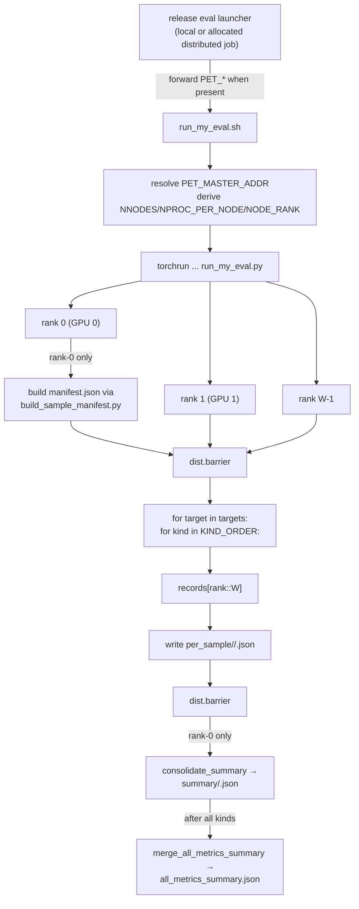

# Distributed T2AV Evaluation Toolkit (`my_eval`)

End-to-end evaluation pipeline for T2AV samples laid out in the
[`submit_versebench_eval.sh`](../submit_versebench_eval.sh) "joint_av" format:

```
<sample-root>/<experiment>/samples/step-NNNNNNNN/joint_av/cfg_dual/
    sample-versebench-NNNN-setX.{mp4,wav}
```

Metrics covered (MOVA-aligned where MOVA implements them, Verse-Bench-aligned
otherwise):

| Group | Metric | Source |
|-------|--------|--------|
| AV sync | DeSync | MOVA `eval_av_quality.py` (Synchformer two-window argmax) |
| AV sync | AV-Align | Optional: MOVA `av_align_score.py` (onset/optical-flow IoU); enable with `--optional-metrics AV-Align` |
| AV sync | LSE-C | MOVA `eval_lip_sync.py` (SyncNet v2, only on `set3`) |
| AV sync | LSE-D | Optional SyncNet distance; enable with `--optional-metrics LSE-D` |
| Alignment | IB-AV | MOVA / ImageBind cosine(video, audio) |
| Alignment | IB-TV | New: ImageBind cosine(video, text=record.av_caption) |
| Alignment | IB-TA | New: ImageBind cosine(text=record.audio_prompt, audio) |
| Alignment | PE-TV, PE-TA, PE-TAV + cosine variants | facebook/pe-av-large text↔video/audio/audio-video similarities |
| Alignment | CLAP | MOVA `eval_audio_is_clap.clap_single_score` |
| Visual | MS | Verse-Bench RAFT motion score |
| Visual | AS = mean(Aesthetic, MusiQ, ManiQA) | Verse-Bench `aesthetic/*_inferencer.py` |
| Visual | ID | Verse-Bench DINOv3 reference-image consistency |
| Audio | FD, KL | Verse-Bench CLAP-FD / PaSST-KL against reference audio when available |
| Audio | DNSMOS P808 | MOVA `eval_dnsmos.py` (ONNX) |
| Audio | RMS, LUFS | Optional: MOVA-compatible signal stats; add with `--extra-kinds audio_amplitude` |
| Audio | IS (PANNs Cnn14, dataset level) | MOVA `eval_audio_is_clap.IS.calculate_inception_score` |
| Audio | CE, CU, PC, PQ | Verse-Bench `audio_box/audio_box_inferencer.py` |
| Speech | WER | Verse-Bench `wer/wer_inferencer.py` against `speech_prompt.text` |

No overall score is computed. Each metric writes a per-sample JSON and a
per-target summary JSON bucketed by `set1` / `set2` / `set3` / `all`; summaries
also include per-metric `num_success`, `num_failed`, and `num_skipped` counts.

## Layout

```
my_eval/
├── run_my_eval.sh                     # torchrun launcher (sources Verse-Bench common.sh by default)
├── setup_my_eval_deps.sh              # install panns-inference + minor extras into verse-bench env
├── run_my_eval.py                     # dispatcher
├── plot_my_eval_results.py            # comparison curves across (exp, step) per metric
├── tasks/
│   ├── __init__.py                    # KIND_ORDER + registry
│   ├── av_sync_imagebind.py           # DeSync + IB-AV + IB-TV + IB-TA (+ optional AV-Align)
│   ├── lip_sync.py                    # LSE-C (+ optional LSE-D)
│   ├── pe_av.py                       # PE-TV + PE-TA + PE-TAV + cosine variants (facebook/pe-av-large)
│   ├── audio_clap.py                  # CLAP
│   ├── video_motion.py                # MS (RAFT motion score)
│   ├── video_aesthetic.py             # Aesthetic + MusiQ + ManiQA + AS
│   ├── identity_dino.py               # ID reference-image consistency
│   ├── audio_fd_kl.py                 # FD + KL against reference audio
│   ├── audio_box.py                   # CE/CU/PC/PQ
│   ├── speech_wer.py                  # WER
│   ├── audio_dnsmos.py                # DNSMOS P808
│   ├── audio_is.py                    # PANNs Inception Score (dataset-level)
│   └── audio_amplitude.py             # Optional RMS + LUFS
└── utils/
    ├── distributed.py                 # PET_* / torchrun bookkeeping
    ├── manifest.py                    # target discovery + manifest IO
    ├── io_utils.py                    # per-sample + summary writers
    └── audio_video.py                 # ffmpeg mux, wav loader
```

Per-target outputs:

```
<eval-output-root>/<exp>/<step>/<cfg>/
├── metadata/manifest.json                              # via build_sample_manifest.py
├── per_sample/<metric_kind>/<file_stem>.json
├── summary/<metric_kind>.json                          # buckets: set1 / set2 / set3 / all
├── all_metrics_summary.json                            # merged view of all summaries
└── tmp/<metric_kind>/rank{R}/...                       # rank-local intermediate files
```

## Distributed model



The default dispatcher is `kind-major-reuse`: it loads one metric kind, runs
that metric across all pending targets/checkpoints with `reuse_models=True`,
then clears that kind's cache before the next metric. This avoids repeated
model loads per checkpoint without keeping every metric model resident at once.

## Quick start

### 0. Python environment

By default `run_my_eval.sh` runs inside the Verse-Bench conda env created by
the bundled setup script:

```
generation/evaluation/verse_bench/.cache/conda/envs/verse-bench/
```

Bootstrap it once (idempotent):

```bash
# 1. Create the verse-bench conda env if it does not exist yet (downloads
#    Synchformer/audiobox/aesthetic-predictor-v2-5/MANIQA/etc.).
bash generation/evaluation/verse_bench/setup_verse_bench.sh

# 2. Install the handful of extra packages my_eval depends on
#    (panns-inference, descript-audiotools fallback, etc.).
bash generation/infer/t2av/my_eval/setup_my_eval_deps.sh
```

Overrides:

* `MY_EVAL_PYTHON=/path/to/python` — point at any other python binary (the
  script will use it for both the dispatcher and `torch.distributed.run`).
* `--skip-verse-common` flag (or `SKIP_VERSE_COMMON=1`) — assume the calling
  shell already activated a python env; skip sourcing `common.sh`.

### One-shot smoke (single GPU, 4 samples per target)

```bash
cd /path/to/OmniVAE
export OMNIVAE_RELEASE_ROOT=/path/to/omnivae_release

bash generation/infer/t2av/my_eval/run_my_eval.sh \
    --sample-root /path/to/generated/t2av_samples \
    --eval-output-root eval/my_eval_smoke \
    --cfg dual \
    --limit 4 \
    --skip-completed
```

### Release validation wrapper

For public checkpoint validation, prefer the repository wrapper. It runs T2AV
inference first and then calls this evaluator. On a local machine it can launch
directly; inside an already allocated distributed job it consumes `PET_*`
environment variables for rendezvous.

```bash
cd /path/to/OmniVAE
export OMNIVAE_RELEASE_ROOT=/path/to/omnivae_release

bash scripts/release_eval/t2av/run_release_t2av_eval_compare.sh \
    --mode run \
    --cfg 4 \
    --types set3-large \
    --experiments t2av_recon t2av_recon_distill_avclip \
    --output-root /path/to/output/t2av_release_compare
```

The lower-level evaluator remains available through
`generation/infer/t2av/my_eval/run_my_eval.sh` when generated samples already
exist.

## Weight paths

| What | Where |
|------|-------|
| Synchformer state dict | env `MY_EVAL_SYNCHFORMER_CKPT`, or `generation/evaluation/metrics/av_quality/weights/synchformer_state_dict.pth`, or `${OMNIVAE_RELEASE_ROOT}/eval/models/t2av/verse_models/24-01-04T16-39-21.pt` |
| ImageBind huge | downloaded automatically by `imagebind_model.imagebind_huge(pretrained=True)` to `$TORCH_HOME/hub/checkpoints/imagebind_huge.pth`; pre-place if running with `HF_HUB_OFFLINE=1` |
| LAION-CLAP | `generation/evaluation/metrics/audio_is_clap/clap_ckpt/630k-audioset-fusion-best.pt` (auto-downloaded by `setup_weights.sh`) |
| Roberta (CLAP text) | `generation/evaluation/models/roberta-base/` |
| PANNs Cnn14 | `generation/evaluation/metrics/audio_is_clap/pann_home/Cnn14_mAP=0.431.pth` |
| SyncNet v2 | `generation/evaluation/models/wav2lip/evaluation/syncnet_python/data/syncnet_v2.model` |
| SFD face | `generation/evaluation/models/wav2lip/evaluation/syncnet_python/detectors/s3fd/weights/sfd_face.pth` |
| DNSMOS ONNX | `generation/evaluation/metrics/dnsmos/DNSMOS/{model_v8,sig_bak_ovr}.onnx` (committed in repo) |
| PE-AV large | env `MY_EVAL_PE_AV_MODEL_DIR`, or `${OMNIVAE_RELEASE_ROOT}/eval/models/t2av/pe_av_alignment/facebook_pe_av_large` |
| Aesthetic v2.5 + SigLIP | `${MODELS_PATH}/aesthetic_predictor_v2_5.pth` + `${MODELS_PATH}/siglip-so400m-patch14-384/` |
| ManiQA Koniq-10k | `${MODELS_PATH}/ckpt_koniq10k.pt` |
| audiobox-aesthetics | env `MY_EVAL_AUDIOBOX_CKPT` or `${MODELS_PATH}/audiobox-aesthetics/checkpoint.pt` |

`MODELS_PATH` (or `MY_EVAL_VERSE_MODELS`) should point to the Verse-Bench model
directory, normally `${OMNIVAE_RELEASE_ROOT}/eval/models/t2av/verse_models`.

## Batch knobs

These environment variables tune model batch sizes. Reduce the value if a
metric hits CUDA OOM; increase it when GPU memory is underused.
`validate_checkpoints.sh` enables H200-oriented defaults by default
(`MY_EVAL_H200_BATCH_DEFAULTS=1`); set that variable to `0` to use the lower
per-task defaults below, or override any individual variable.

| Env var | Default | Metric path |
|---------|---------|-------------|
| `MY_EVAL_IMAGEBIND_BATCH_SIZE` | `4` | `IB-AV`, `IB-TV`, `IB-TA` |
| `MY_EVAL_PE_AV_MODEL_DIR` | `${OMNIVAE_RELEASE_ROOT}/eval/models/t2av/pe_av_alignment/facebook_pe_av_large` | PE-AV local HF model path |
| `MY_EVAL_PE_AV_BATCH_SIZE` | `2` | `PE-TV`, `PE-TA`, `PE-TAV` and cosine variants |
| `MY_EVAL_PE_AV_DTYPE` | `bf16` | PE-AV inference dtype (`bf16`, `fp16`, `fp32`) |
| `MY_EVAL_AESTHETIC_BATCH_SIZE` | `16` | Aesthetic v2.5 + MusiQ frame batches |
| `MY_EVAL_MANIQA_PATCH_BATCH_SIZE` | `64` | ManiQA crop-patch batches |
| `MY_EVAL_AUDIOBOX_BATCH_SIZE` | `8` | `CE`, `CU`, `PC`, `PQ` |
| `MY_EVAL_CLAP_BATCH_SIZE` | `16` | CLAP text/audio embedding batches |
| `MY_EVAL_DINO_BATCH_SIZE` | `16` | DINOv3 frame batches for `ID` |
| `MY_EVAL_RAFT_EXACT` | `1` | Use Verse-Bench exact `RAFTInferencer.infer` for `MS` |
| `MY_EVAL_RAFT_BATCH_SIZE` | `4` | RAFT adjacent-frame pair batch size when `MY_EVAL_RAFT_EXACT=0` / `MY_EVAL_RAFT_ALLOW_BATCH=1` |
| `MY_EVAL_DATA_PARALLEL_PREWARM` | `0` | Enable a rank-local preprocessing warmup before each target in `--dispatch-mode data-parallel` |
| `MY_EVAL_PREPROCESS_BACKEND` | `dataloader` | Use `thread` for same-process threaded warmup; useful when disk cache is disabled |
| `MY_EVAL_PREPROCESS_WORKERS` | `2` | Preprocessing warmup workers |
| `MY_EVAL_PREPROCESS_VIDEO` | `auto` | `auto` avoids no-disk bulk video predecode; set `1` only when memory/cache settings can hold decoded frames |

Formal H200 validation defaults in `validate_checkpoints.sh`:

| Env var | H200 default |
|---------|--------------|
| `MY_EVAL_PE_AV_BATCH_SIZE` | `32` |
| `MY_EVAL_IMAGEBIND_BATCH_SIZE` | `32` |
| `MY_EVAL_CLAP_BATCH_SIZE` | `64` |
| `MY_EVAL_DINO_BATCH_SIZE` | `32` |
| `MY_EVAL_AESTHETIC_BATCH_SIZE` | `32` |
| `MY_EVAL_MANIQA_PATCH_BATCH_SIZE` | `128` |
| `MY_EVAL_AUDIOBOX_BATCH_SIZE` | `32` |
| `MY_EVAL_WER_BATCH_SIZE` | `16` |
| `MY_EVAL_LIPSYNC_BATCH_SIZE` | `32` |
| `MY_EVAL_RAFT_BATCH_SIZE` | `8` |

## Forwarded flags

| Flag | Default | Description |
|------|---------|-------------|
| `--sample-root` | required | discovery root (see layout) |
| `--eval-output-root` | required | results live here |
| `--experiments NAME [NAME ...]` | all | restrict to a subset of experiment dirs |
| `--steps "S1 S2"` | all | whitelist of step ints |
| `--cfg {dual,simple,both}` | `dual` | which cfg_* dir(s) to evaluate |
| `--kinds k1,k2,...` | all kinds | subset of `KIND_ORDER` |
| `--limit N` | 0 | cap per-target sample count |
| `--skip-completed` | off | skip samples that already have a per_sample JSON |
| `--dispatch-mode` | `kind-major-reuse` | default model-reuse mode; alternatives: `subtask`, `data-parallel`, `sample-major` |
| `--scan-workers N` | 1 | rank-0 thread workers for the `--skip-completed` target-completion scan |
| `--max-ckpt-per-experiment N` | 0 | keep top-N step values per experiment |
| `--build-manifest-script PATH` | `generation/infer/t2av/build_sample_manifest.py` | manifest builder |
| `--valid-jsonl PATH` | `${OMNIVAE_RELEASE_ROOT}/eval/data/t2av/versebench_minimal/versebench_t2av_infer_minimal.jsonl` | manifest prompt source |

## Differences from MOVA `run_eval.sh`

| Concern | `mova_eval` | `my_eval` |
|---------|-------------|-----------|
| Layout | flat `<input>/<ckpt>/<category>/*.mp4` with audio embedded | joint_av `(mp4, wav)` pairs sliced by manifest |
| Process model | 5 conda envs, one subprocess per metric | single env, one torchrun process per rank, kinds run sequentially in-process |
| Distribution | none (single GPU) | full torchrun, `records[rank::world_size]` per kind |
| Overall score | per-metric JSON only | per-metric JSON only (no overall score, matches user request) |
| AS / audiobox | not present | ported from Verse-Bench |
| IB-TV | not present | added |

## Plotting checkpoint sweeps

Use `plot_my_eval_results.py` (mirrors `generation/infer/t2av/plot_eval_results.py`
but reads `my_eval`'s `summary/` layout):

```bash
python generation/infer/t2av/my_eval/plot_my_eval_results.py \
    --eval-root /path/to/eval/my_eval \
    --cfg cfg_dual                      # repeatable / optional (default: all cfgs)
    --workers 16                        # parsing + plotting parallelism
```

By default plotting reads `summary/<kind>.json` / `all_metrics_summary.json`.
Add `--from-per-sample` to recompute aggregates from
`per_sample/<kind>/*.json`; this preserves filename-derived categories such as
`set3`, `set3-large`, and `set3-medium-large`.

Outputs land under `<eval-root>/_plots/` (override with `--output-dir`):

```
_plots/
├── metrics_long.csv                   # one row per (exp, step, cfg, metric, category)
└── <cfg>/                             # e.g. cfg_dual/
    ├── all/<metric>.png               # dataset-wide curve, one experiment per line
    ├── set1/<metric>.png              # same curve restricted to category=set1
    ├── set2/<metric>.png
    ├── set3/<metric>.png
    ├── all_sets/<metric>.png          # 2x2 grid: set1 / set2 / set3 / all
    ├── _groups/<group>.png            # thematic dashboards (5 groups defined)
    └── _all_metrics/<view>.png        # one giant figure, every metric x every group
```

Direction badges in titles:
- `[↑ higher is better]` -- e.g. CLAP, IB-AV, IS, AS, AudioBox CE/CU/PQ
- `[↓ lower is better]`  -- e.g. DeSync, LSE-D, WER, FD, KL, AudioBox PC
- `[— descriptive]`      -- e.g. amplitude_rms, loudness_lufs

`--csv-only` skips PNG rendering when you just want the long-format CSV.

## Troubleshooting

* `Synchformer checkpoint not found` -- set `MY_EVAL_SYNCHFORMER_CKPT` or place
  `synchformer_state_dict.pth` under `generation/evaluation/metrics/av_quality/weights/`.
  The toolkit also falls back to Verse-Bench's `24-01-04T16-39-21.pt`.
* `ImportError: av_bench.data` -- the upstream `av_bench` source has an extra
  `data/` subpackage not vendored locally. `av_sync_imagebind.py` only depends
  on `av_bench.synchformer.synchformer.Synchformer`, which IS vendored, plus
  the upstream ImageBind helpers. If you still hit this, install
  `pip install -e generation/evaluation/metrics/av_quality/av_bench --no-deps`
  and ensure that env has its own `av_bench.data` (e.g. fork
  https://github.com/hkchengrex/av-benchmark).
* `aesthetic_predictor_v2_5` errors -- install via
  `pip install aesthetic-predictor-v2-5` and place
  `aesthetic_predictor_v2_5.pth` + `siglip-so400m-patch14-384/` under `MODELS_PATH`.
* `Lip-sync stuck waiting for DNS` -- `LAION_BASHRC` is sourced once and never
  re-resolved; pass `--skip-bashrc` if your launcher already activated the env.
